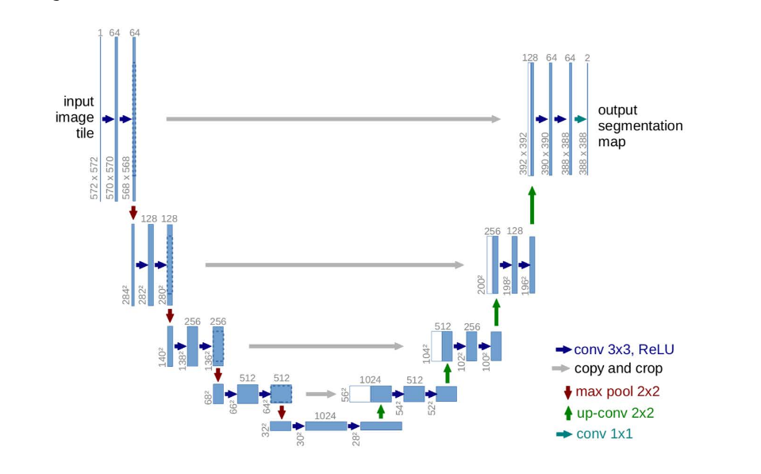

# Deep Neural Networks: Defect Segmentation on Textured Surfaces

## Description
Development of a model to detect defects by Industrial Optical Inspection on Textured Surfaces. This problem can be modelled as an Image
Segmentation task where you will have to find the pixels where the defect occurs in a given image. \

## Dataset used 
The dataset used is described [here](https://hci.iwr.uni-heidelberg.de/node/3616)

## Approach used
The approach ised is based on the following paper  - [U-Net: Convolutional Networks for Biomedical Image Segmentation](https://arxiv.org/abs/1505.04597)

## Model
Below is a picture of the model (from U-net paper) used to solve the segmentation task.

